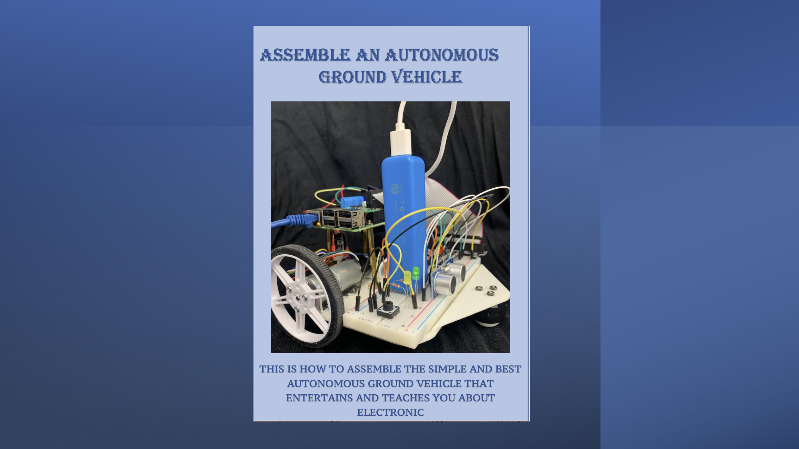
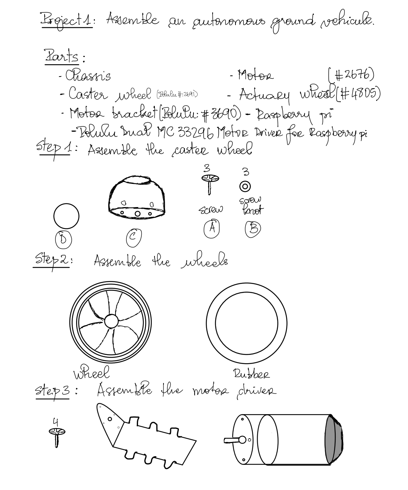
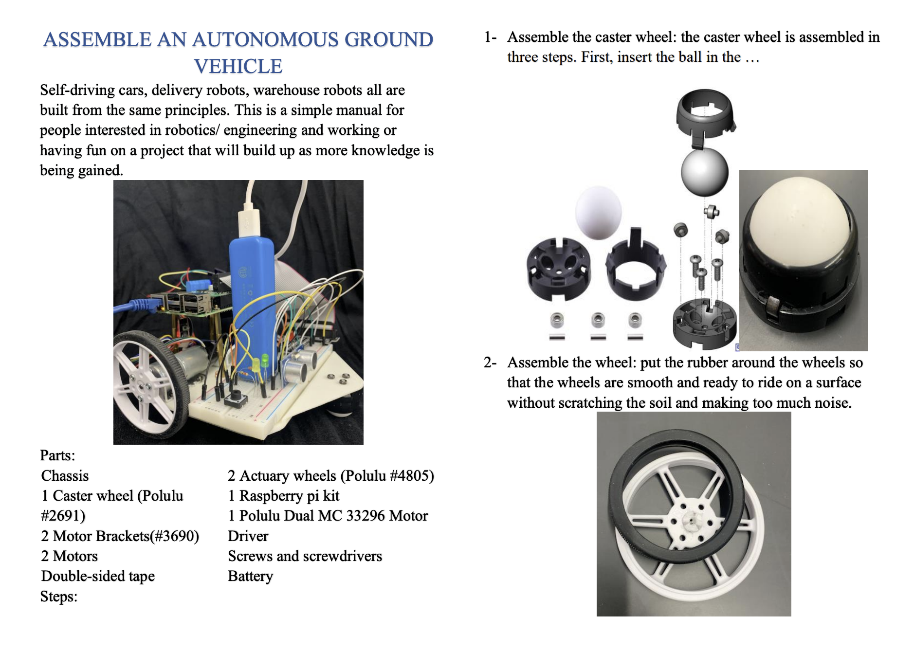
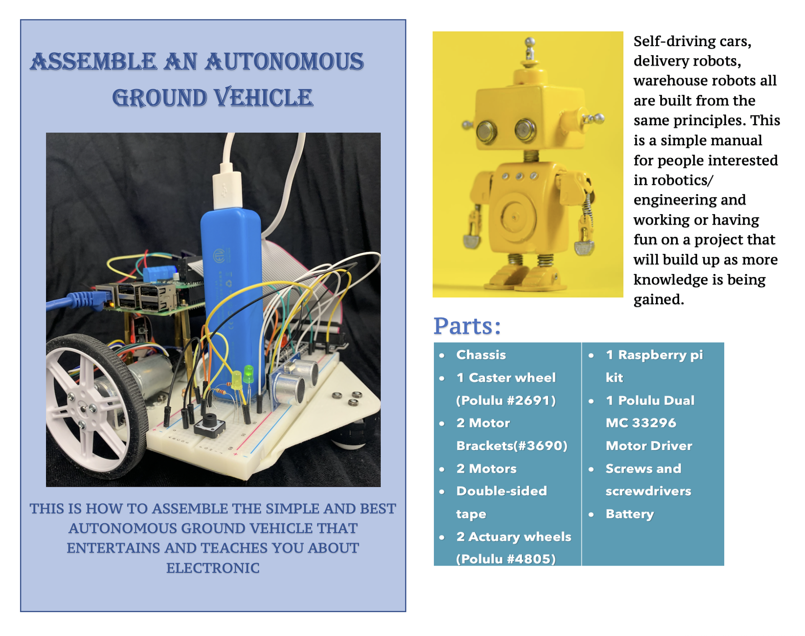

## Abstract 
The purpose of this project was to create a user manual for an identified audience. I decided to go with an autonomous ground vehicle because I built one and can use my own pictures and details. The paper required sequential steps and review before submission. I will include the first page of each drafts to show the evolution of the projects throughout the drafting process.

## Draft 1
The first draft for the project was done on a piece of paper with some drawings and general points idea.  The main concern at this step was about how to switch from the paper format to a digital format.

## Draft 2
After the peer review with my classmates, I took in consideration their comments for the draft 2. For the draft 2 I refer to my computer and took some pictures of my robot at the lab with the steps it took me to build. At this point most of the work was done and was submit for peer review to classmates.

## Draft3 
After the peer review of the draft 2, I realized that I should have more visuals and format the paper. I used power point and word to make the presentation page and order the tables.

Overall the project was a success. However, it was challenging to use less sentences and include clear images with steps so that the reader could directly refer. Also because one of my main goal was for the reader to find a specific information without having to go through all the paper, I had to put myself at the place of the reader.