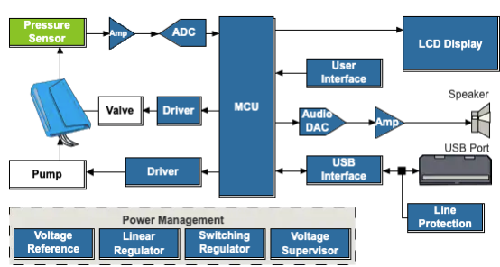

  

## Abstract
In microelectronics, we studied operational amplifier and made numerous applications.  For one of the class exam, we were asked to work with a pressure sensor and come up with an application of our choice using operational amplifier. The circuit in this application are based on knowledge on voltage divider and operational amplifier.

## Introduction
Blood pressure monitor are used in medicine to measure the blood pressure in an artery. Most blood monitor use an absolute pressure sensor (Honeywell’’26 PC SMT pressure sensor is an example and illustrated by image 5). The monitor contains a pressure sensor for sensing arterial wall vibration which is the force of blood on artery. 

The blood pressure is determined by the amount of blood pomp by the heart and the diameter of the arteries. It is measured as the heart contracts (systole) and relaxes(diastole). The normal range of blood pressure for a human is between 100-115 mmHg for the systole and 75-70 mmHg for the diastole. In fact, the more blood pumped and the narrower artery, the higher the pressure leading to a high blood pressure. Permanent high blood pressure can damage organs and result in a heart attack. A systolic of 140mmHg and diastolic of 90 mmHg are considered as very high blood pressure for human. mmHg standing for millimeters of mercury is a pressure unit (1mmHg= 133Pa). The general diagram of the monitor is illustrated by the figure below.

## Setup
The general diagram of the blood pressure monitor was modified to get mount to a differential amplifier circuit in Figure2. 

### Pin connections across the pressure sensor

### Pin connections across the 411 operational amplifier

The output voltage of the pressure sensor will be displayed by a multimeter and compare to our pressure vs output voltage data to deduce if the blood pressure is high or normal. Since, we do not have all the materials required for this experiment, we used linear interpolation to estimate the output voltage for normal range of blood pressure and high blood pressure.

## Modeling
To get an estimation of the output voltage, we converted the estimated pressure from mmHg to atmosphere and use the equation of the trendline in part 2 to estimate the range voltage for a normal blood pressure and the resulting output voltage for a high blood pressure. 
The ideal gas law PV= nRT was used to determine the pressure. Since the number of mol and the temperature are constant, the formula can be reduced to Pi *Vi= Pf *Vf with Vi= 30 ml and Pi= 1 atm. 

According to table 3, an output voltage between o.8V and 0.92V for the systolic and 0.85 V to 0.86 V to the diastolic are great for a human. 

However, from table 4, whenever the voltage reaches around 0.95 V for the systolic and 0.88 V for the diastolic, the patient has a high blood pressure and need to be consulted.

## Sources
[Freescale Semiconductors, MPX 2200](https://www.nxp.com/docs/en/data-sheet/MPX2200.pdf)

[Blood Pressure Monitor](https://www.mouser.com/applications/medical_application_bpmonitor/)

University of Central Arkansas: Dr. William Slaton.