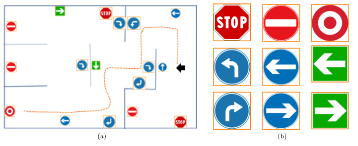

## Goal: 
The goal of this project was to cumulate all the material learned ("ranging from developing a control architecture, compute mobile robot kinematics, implement navigation algorithm based on sensor fusion and environment represensation, contruct, program and test the operation of a robotic system to perform a specific task and follow correct experimentatl design procedures") through the Fall 2023 term from the Introduction to Robotics Research (ECE7785) class at Geogia Tech. 
The main objective of the final project is to integrate multi modal sensing and navigation into a single reasoning system. The robot should be able to complete the maze above by following signs. My teammate (Daniel Butterfield) and I approach the problem by training a K-Nearest Neighbors(KNN) algorithm to classify the image and use R0S 2 for the navigation part. We initially drive the robot around the maze and collected a set of 5000 images data that we manually labeled using the matplotlib display util. We maximize having images of signs to be classified by our model. 
We used two models, one responsible for classifying red signs and a second if the sigh is the the blue shade. We specified the range of red and blue for each model. 
Overall our robot performed great. However at some corners due to shading, it was useful to light up the signs with a lamp for the algorithm to accurately classify the signs. The project is documented under our github [repository](https://github.com/nadira30/Final_ECE7785). 

Here is a video of our robot during the final examination. 

 <video 
      controls autoplay muted>
        <source src="../../assets/articles/SD/wham_win.mp4" type="video/mp4">
  </video>
