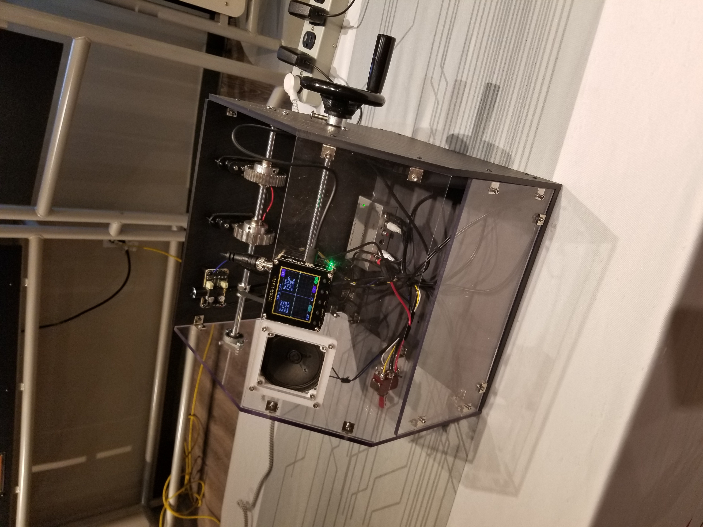
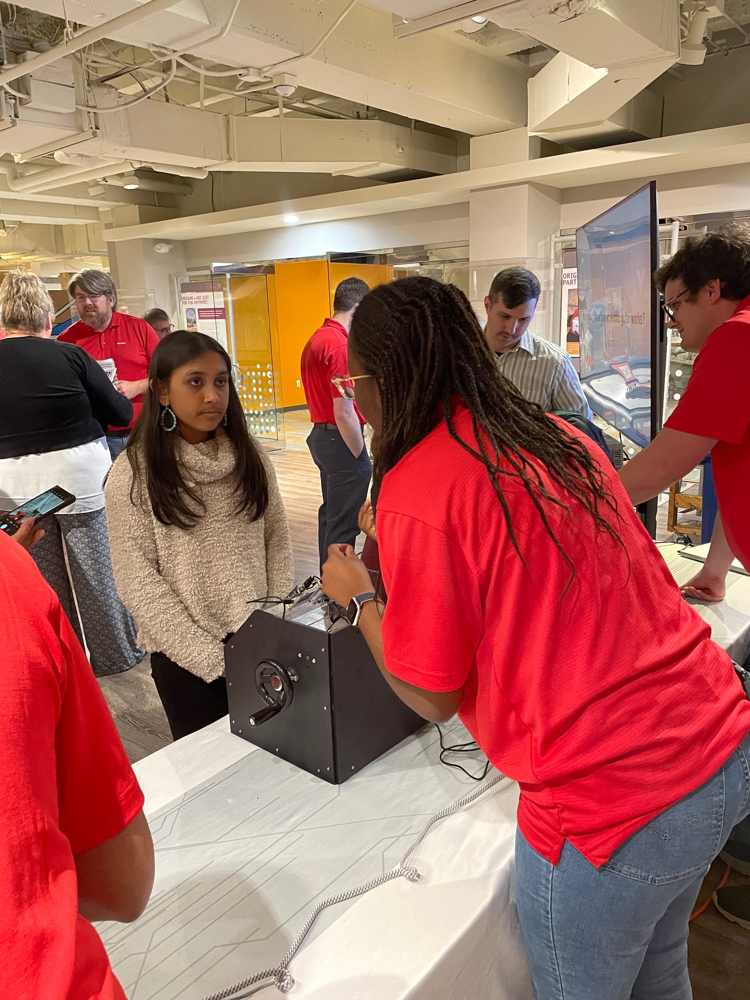

Here are numerous class projects I have been involved inover the past 2 years: 

### Kelp segmentation page 
As part of the Computer Vision class I took in Spring 2024, my team and I work on an algorithm to detect Kelp Forest using various satellite images channels (SWWIR, NIR, NDVI). 
The main goal of the project is to monitor and protect kelp forest while addressing ecological threats that are overfishing and climate change. 
Refer to the [webpage](https://nadira30.github.io/kelp_segmentation/) for more information. 

### Fake news detection page 
As part of the Machine Learning Algorithm, I took in the Spring 2024 term, my team and I worked on developping two supervised and one unsupervised learning algorithm capable of detection fake news. 
Refer to the following [webpage](https://nadira30.github.io/7641-Group-Project/) for more information. 

### Senior design page
As part of my undergraduate senior design project, my team and I participated in the National Robotics Challenge and the Arkansas Space Grant Consortium project. 
We design an automous ground vehicle capacle of navigating 4 main points using a convolution neural network and the Donkey Car open source API. 
My main task was to work on improving and training the neural network for better results and design and update the web page. 
Please refer to the following [page](https://github.com/willward20/WHAM) for more information. 

### Industry project
During my Co-Op at Molex LLC, I propose the project: Demonstrate how an electric guitar works by using a tone wheel generator; as part of a project between the Musuem of Discovery and Molex to introduce Sixth graders to Science. 

    
    

### Microclimate Envorionment 
As part of a microcontroller class at the University of Central Arkansas, my group and I designed a system capable of controling the temperature and moisture of a microenvironment(incubator) for growing lizzard eggs.
The system is powered by a raspberry pi. My team and I designed the circuits using the knowledge gain over the course and test our prototype. 
I specifically focused on the moisture control for the soil using capacitive soil moisture and a water pump. 
Refer to the report our work [here](https://docs.google.com/document/d/1N8TD3TCL0ZojVxcyGYNkDk4SEOtTg0cW0MWFkEMRnuU/edit?usp=sharing). 